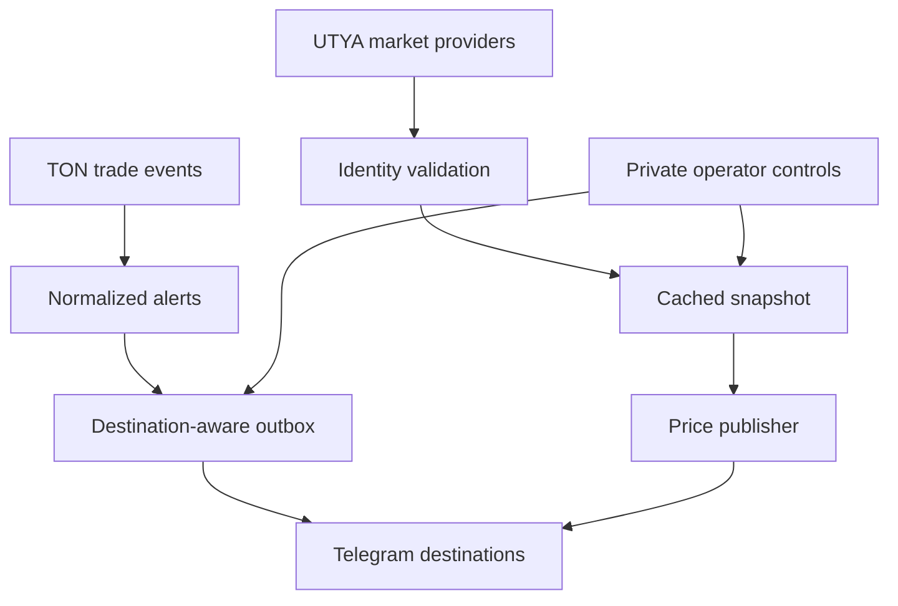

# Architecture

```mermaid
flowchart TD
    M["UTYA market providers"] --> V["Identity validation"]
    V --> S["Cached snapshot"]
    S --> P["Price publisher"]
    E["TON trade events"] --> N["Normalized alerts"]
    N --> Q["Destination-aware outbox"]
    Q --> D["Telegram destinations"]
    P --> D
    O["Private operator controls"] --> S
    O --> Q
```

The outbox advances per destination only after successful delivery. Exact destination state, identifiers, provider selection, and trade logic are private.
